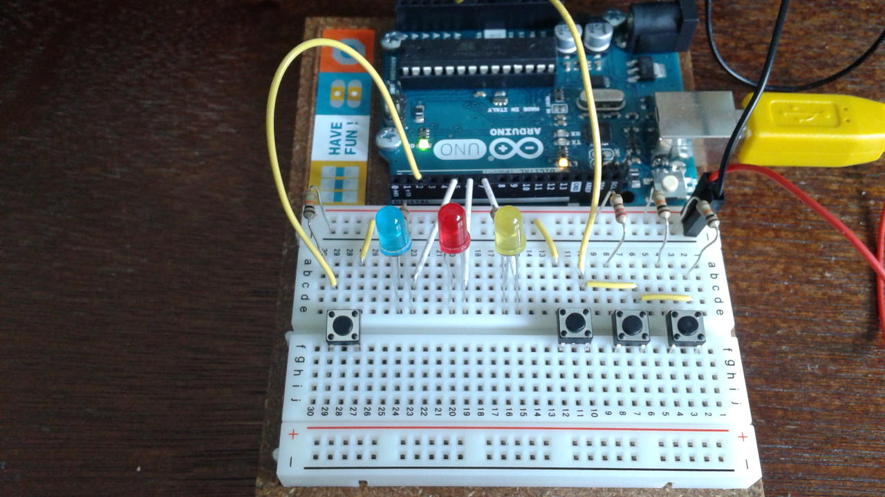
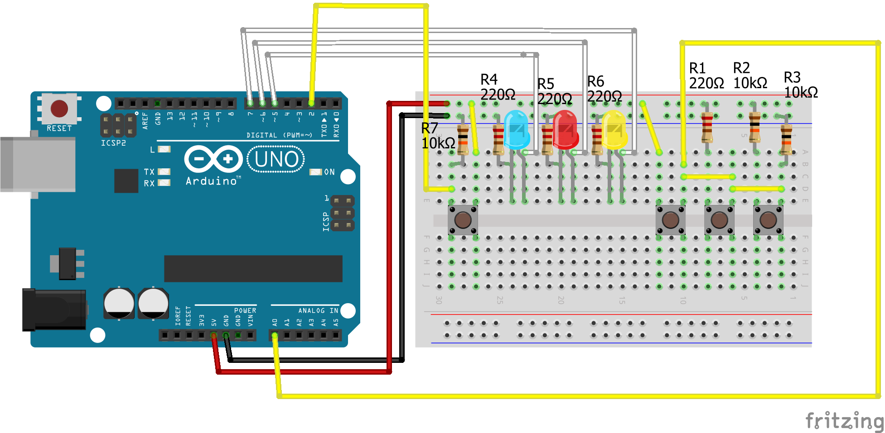
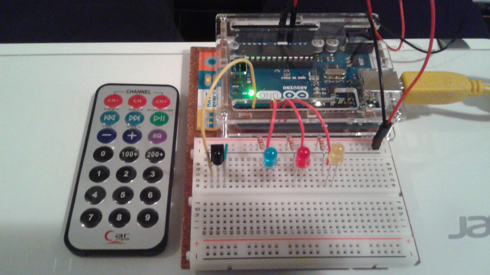
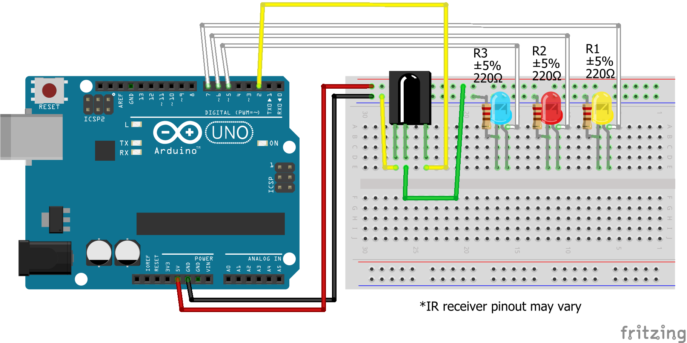

# LED Memorization Game

The goal of the game is to repeat the randomly generated sequence of LEDs. A player must play sequences equal to the current level in order to level up, and once all the sequences in the maximum level have been played, the player wins.

### Versions
There are two versions of the game:
* [Analog Input](#analog-input)
* [IR Remote Input](#ir-remote-input)

You can specify which version of the game to load onto the board by changing the value of the VERSION macro in GameData.h. More info in the Instructions section of each version.

### Controls
- Reset button to start the game if it hasn't started, reset the player's inputs for the current sequence if the game has started.
- Three buttons that are each associated with an LED to input the sequence.

# Analog Input
This version of the game uses three voltage dividers connected to a single analog input pin. The voltage of each button differentiates the inputs.

### [Demo Video](https://vid.me/6wrT)

### Components
- Arduino Uno
- LEDs x3
- Pushbuttons x4
- 220 Ω Resistors x4
- 10k Ω Resistors x3
- Jumper wires

### Instructions
- Change the value of the VERSION macro in GameData.h to ANALOG_INPUT.
- Create the circuit, load the LedMemorizationGame.ino sketch onto your Arduino Uno, and play. Circuit diagram is in the Images section below.

### Images

# IR Remote Input
This version of the game uses an IR Receiver and an IR Remote as input. Each button is mapped to a hexadecimal number to differentiate the inputs.

### [Demo Video](https://vid.me/yvs7)

### Components
- Arduino Uno
- IR Receiver (This project uses the TSOP38238 38KHz receiver)
- IR Remote (This project uses a 38KHz remote)
- LEDs x3
- 220 Ω Resistors x3
- Jumper wires

### Required Libraries
- [Arduino IRremote](https://github.com/z3t0/Arduino-IRremote)

### Instructions
- Load the IRrecvDemo.ino sketch onto your Arduino Uno in the examples folder of the Arduino IRremote library to get the hexadecimal codes for your IR remote. Write them down.
- Change the value of the VERSION macro in GameData.h to IR_INPUT.
- Change the values for the LED_1_BUTTON, LED_2_BUTTON, LED_3_BUTTON, and RESET macros in GameData.h to the hexadecimal codes of the buttons you would like to use.
- Create the circuit, load the LedMemorizationGame.ino sketch onto your Arduino Uno, and play. Circuit diagram is in the Images section below.

### Images

